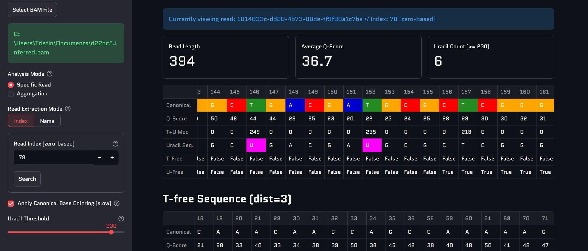
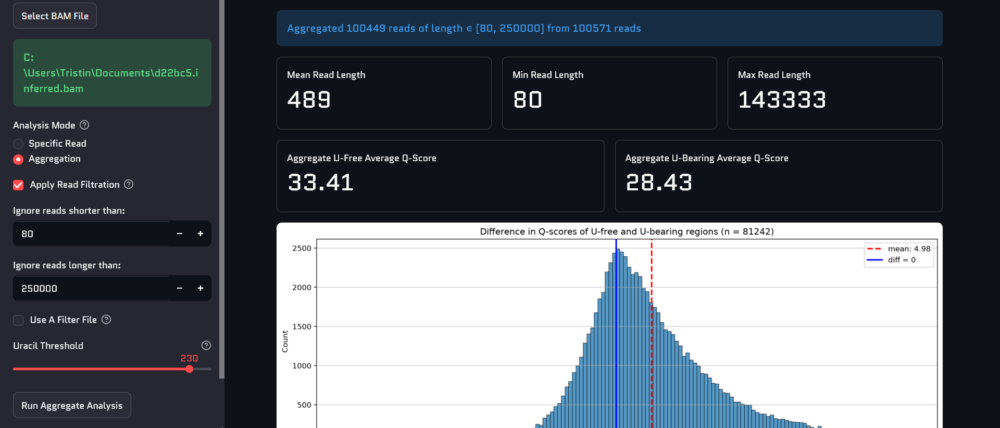

# Ghost Spine
A program to visualize the inferences made by Ghost Shark

## Usage
In the directory where GhostSpine is installed, run `streamlit run app.py`. This will launch a browser window with the program running locally. If you need a compiled version, see the Compiled Versions section of the README.

Assuming you have a BAM file that was run through Ghost Shark, select it inside Ghost Spine and choose an analysis mode.

### Specific Read Mode
This mode is for the inspection of individual reads in the BAM file. Select a read by either inputting its index or name. Once a read is selected, a Uracil threshold can be set.

#### Features
* Read length, average Q-score, and number of suspected uracils based on the set threshold
* A full visualization chart for each position in the read, showing the canonical base, Q-score, T+U Mod score, and more
* Optional coloring of Canonical Sequence and Suspected Uracils
* A visualization of a read's T-free sequence
* Q-score comparisons ot T-free, T-bearing, U-free, and U-bearing regions
* Q-score histograms for U-free and U-bearing regions
* The first and last 100 T+U Mod Scores

### Aggregate Mode
This mode is for viewing aggregate statistics of every read in the BAM file. The reads to include in aggregate mode can be filtered by length, or by using a filtration text file.

#### Features
* Mean, minimum, and maximum read lengths
* Aggregate Q-score averages for U-free and U-bearing regions
* Histogram of U-free and U-bearing Q-score differences
* Box plots for U-free and U-bearing Q-scores
* Canonical base proportion
* Base proportion with suspected Uracil included
* Aggregate Uracil count per index in the first 50 positions

## Compiled Versions
Compiled versions of GhostSpine are available, but they are generally inferior to running GhostSpine in a Python environment. Only use the compiled versions of GhostSpine if setting up an environment is impractical.

The downside of compiling a python codebase to an exe is that said exe is flagged by the antivirus and is prevented from running. For Windows, select the downloaded Zip file, right click, and navigate to properties. In the General tab, find security, click unblock, and click apply. Then extract, navigate to the exe, and run it as normal. This step is not required if running GhostSpine in a Python environment.